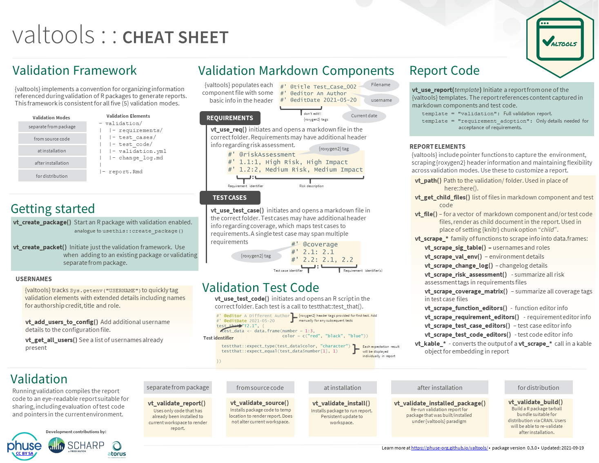
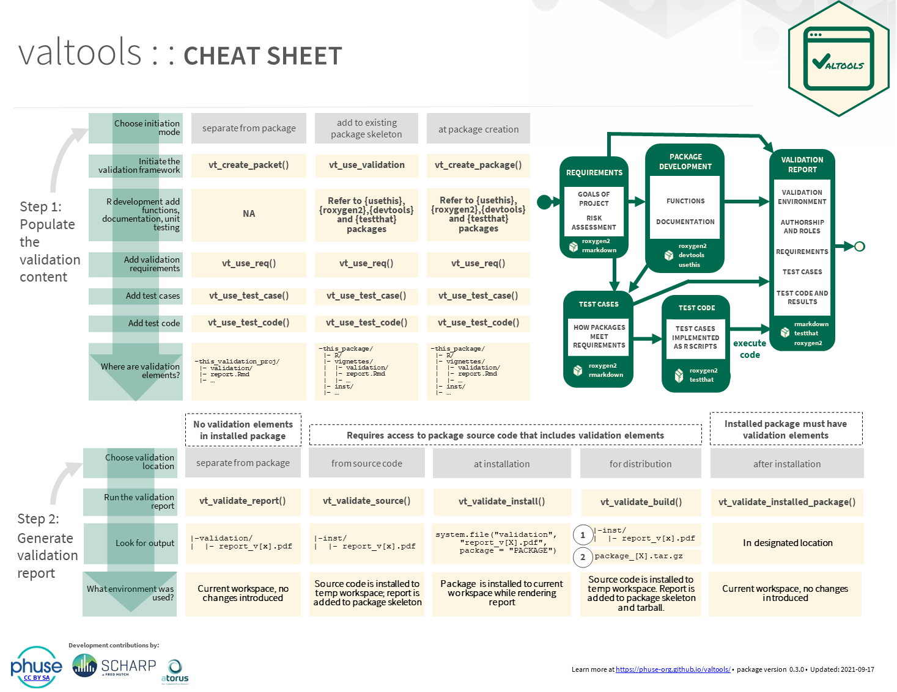

<!-- badges: start -->
  [](https://github.com/phuse-org/valtools/actions/workflows/R-CMD-check.yaml)
  [](https://codecov.io/gh/phuse-org/valtools?branch=main)
  [](https://opensource.org/licenses/MIT)
<!-- badges: end -->

# valtools 

valtools helps automate the validation of R packages used in clinical research and drug development:
It provides useful templates and helper functions for tasks that arise during project set up and development
of the validation framework.


This package is created by the [R Package Validation Framework PHUSE Working Group](https://advance.phuse.global/display/WEL/R+Package+Validation+Framework).

For background on the `R Package Validation Framework`, watch [this presentation](https://www.rstudio.com/resources/rstudioglobal-2021/r-package-validation-framework/) from RStudio::Global Pharma X Session.


## Installation

To install the most recent release, use:

```
remotes::install_github("phuse-org/valtools", ref = "V0.4.0")
```

{valtools} is under active development. To get the very latest version in development, use:

```
remotes::install_github("phuse-org/valtools")
```

## Usage

{valtools} is intended to be a bolt-on addition to the standard package development process followed by [usethis](usethis.r-lib.org) and [devtools](https://devtools.r-lib.org/). All {valtools} functions start with `vt` followed by a verb/descriptor to make them easy to follow. 
The most common usage for valtools is to add elements required for validation under the R Package Validation Framework and facilitating validation. See the [`Starting New Validation Package using {valtools}`](vignettes/starting-validated-package.Rmd) vignette for more details.

#### Adding Validation Content

- `vt_use_validation()` adds the validation infrastructure to an existing R package.
- `vt_use_req()`, `vt_use_test_case()`, `vt_use_test_code` add the requirements, test cases and test code to the validation folder.
- `vt_use_change_log()` creates a change log in the validation folder
- `vt_use_report()` creates the validation report Rmd that gets rendered into the validation report.

#### Authoring A Validation Report

These functions are helper functions for use within the validation report Rmd.

-   `vt_path()` allows user to base path from the validation directory.  Similar idea to the {here} package, but for validation.
-   `vt_file()` allows the user to point to specific files and render them as child documents within the report.
-   `vt_scrape_*` family of functions allows users to scrape information from the validation infrastructure and returns a data.frame.

    - `vt_scrape_sig_table()` Scrapes the usernames and roles from the validation config file
    - `vt_scrape_val_env()` Scrapes the environment to give a snapshot of what packages and versions are loaded during validation   
    - `vt_scrape_change_log()` Scrapes the change log
    - `vt_scrape_coverage_matrix()` Scrapes the coverage roxygen tags in the test case
    - `vt_scrape_function_editors()` Scrapes the editors of all the functions
    - `vt_scrape_requirement_editors()` Scrapes the requirement editors
    - `vt_scrape_test_case_editors()` Scrapes the test case editors
    - `vt_scrape_test_code_editors()` Scrapes the test code editors   
    - `vt_scrape_risk_assessment()` Scrapes the risk assessments

-   `vt_kable_*` family functions provides an opinionated formatting to
    the `vt_scrape_*` functions to help quickly construct the report.
-   `vt_get_child_files()` returns the list of files that are indicated
    in the validation.yml to be included in the validation report. This
    allows for batch creation of the dynamic content in the report.

#### Validating

- `vt_validate_source()` installs the package temporarily and executes the validation report rmd to validate the source code on the current system.
- `vt_validate_build()` installs the package temporarily, executes the validation report rmd, and compiles it into a bundle for installing.
- `vt_validate_install()` installs the package temporarily, executes the validation report rmd, and installs the library to the machine.
- `vt_validate_installed_package()` runs the validation report rmd for a package that was installed using `vt_validate_install()` for when the environment has changed.

## Vignettes

Read the [`Starting New Validation Package using {valtools}`](vignettes/starting-validated-package.Rmd) vignette for a high level overview of the functions that exist in {valtools} and their intended uses.

## Cheat Sheet

Cheat sheet on how to use the {valtools} R Package

<a href="man/figures/cheatsheets/valtools-cheatsheet/valtools-cheatsheet-p1.png">

</a>

<a href="man/figures/cheatsheets/valtools-cheatsheet/valtools-cheatsheet-p2.png">

</a>


## Code of conduct

Please note that the {valtools} project is released with a [Contributor Code of Conduct](CONDUCT.md). By contributing to this project, you agree to abide by its terms.

